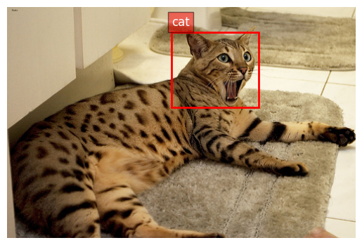

# pytorch-object-detection-fundamentals
This repository is a pytorch implementation of a simple classifier + single object detector model.




## How to detect objects?

Although simple, for some beginners its not really straightforward to think in training a model to predict 4 coordinates. But it turns out to detect a single object you really just need to add a head into your model that outputs 4 floats, add sigmoid (which outputs from 0 to 1) and optimize using MSE. 

You will predict the area of the images in terms of 0 to 100% (in float of course), that way not only you can find objects independently of resolution but also have a much nicer activation function to work with in 0-1 range.

```py
class SimpleObjectDetectionNet(nn.Module):
    def __init__(self, num_classes):
        super().__init__()
        self.num_classes = num_classes 
        
        # Load the pretrained ResNet-18 model
        self.backbone = models.resnet18(weights=models.ResNet18_Weights.DEFAULT)

        # Remove the fully connected layer of ResNet-18
        self.backbone = nn.Sequential(*list(self.backbone.children())[:-2])
        
        # Flatten the output from the backbone
        self.flatten = nn.Flatten()
        
        # Bounding box regression head
        self.bboxHead = nn.Sequential(
            nn.Linear(512 * 7 * 7, 128),
            nn.ReLU(),
            nn.Linear(128, 64),
            nn.ReLU(),
            nn.Linear(64, 32),
            nn.ReLU(),
            nn.Linear(32, 4),
            nn.Sigmoid()
        )
        
        # Classification head
        self.classificationHead = nn.Sequential(
            nn.Linear(512 * 7 * 7, 512),
            nn.ReLU(),
            nn.Dropout(0.5),
            nn.Linear(512, 512),
            nn.ReLU(),
            nn.Dropout(0.5),
            nn.Linear(512, num_classes),
            nn.Softmax(dim=1)
        )

    def forward(self, x):
        x = self.backbone(x)
        x = self.flatten(x)
        
        bbox = self.bboxHead(x)
        class_label = self.classificationHead(x)
        
        return bbox, class_label
```

Thats all you need. The difficulty in object detectors lies on multiple object detection and of course, in not knowing the number of objects in the scene. For that it's a whole new study, but to understand the process of optimizing things that are not just using softmax (like every classifier for images and every NLP model that just predicts next token) that's enough.

Dataset can be downloaded [here](https://www.kaggle.com/datasets/julinmaloof/the-oxfordiiit-pet-dataset).
